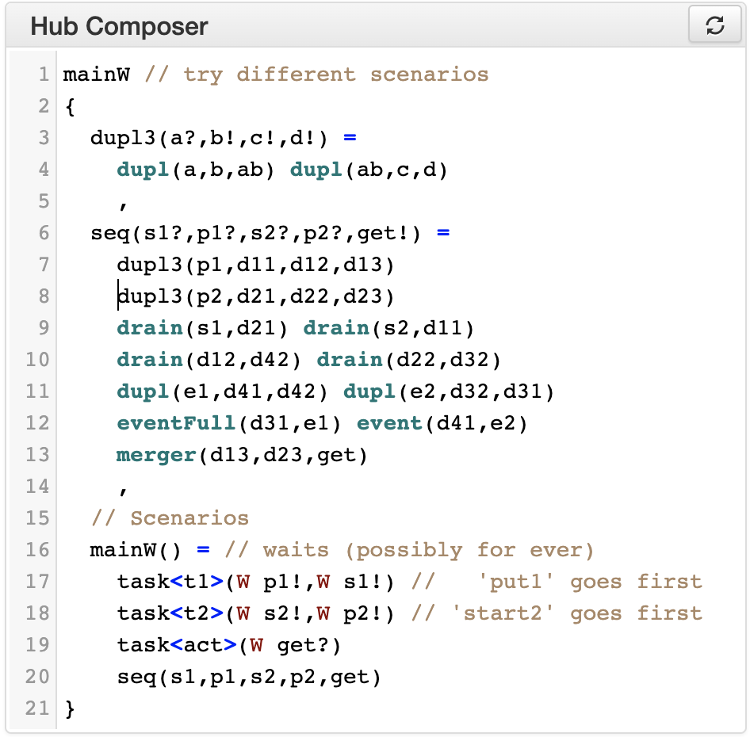

Using the tools
***************

Lightweight vs Server mode
===========================

.. figure:: _static/imgs/lw-vs-server.png
    :align: center
    :target: _static/imgs/lw-vs-server.png

    Lightweight vs Server mode

While the toolset is developed in Scala, the code is compiled both into *JVM*
binaries that are executed on a **server**, and into **JavaScript** using
`ScalaJS <https://wwws.scala- js.org>`_ to produce an interactive web page.

Both versions provide *almost* the same functionality, with the server
additionally supporting the live verification of properties through the Uppaal model checker.
Everything else apart from the live verification is computed
by the browser using the generated JavaScript libraries.

Widgets
=======

Hub Composer
------------

Is the editor to specify the hub... 

    Hub composer - example code

Circuit of the instance
-----------------------

The architectural view of the hub...

Hub Automaton of the instance
-----------------------------

The simplified automaton of the hub...

Examples
--------

A set of hubs examples ...

Context Switch Analysis
-----------------------

An interactive panel to estimate the minimum number of context switches for a given trace ...

Hub Automaton Analysis
----------------------

A summary of some structural properties of the automaton,
such as estimated required memory, size estimation of the code,
information about which hubs’ ports are always ready to synchronise ...

Temporal Logic
--------------

An interactive panel to verify a list of given timed behavioural properties,
relying on Uppaal running in our servers ...

Their result are shown together with the associated Uppaal models and formulas ...

Uppaal Model
------------

The timed automaton to be imported by Uppaal model checker...

