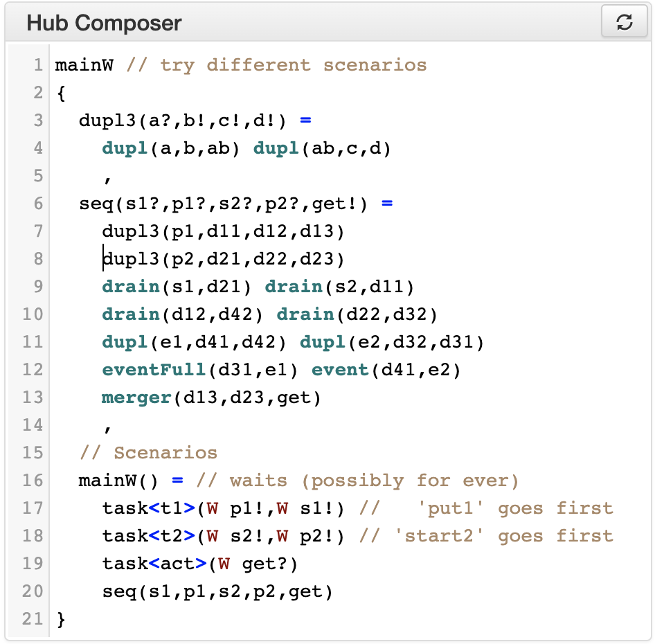

Using the tools
***************

Lightweight vs Server mode
===========================

    Lightweight vs Server mode

While the toolset is developed in Scala, the code is compiled both into *JVM*
binaries that are executed on a **server** (*VirtuosoNext*), and into **JavaScript** using
`ScalaJS <https://wwws.scala- js.org>`_ to produce an interactive web page (*LW VirtuosoNext*).

Both versions provide *almost* the same functionality, with the server
additionally supporting the live verification of properties through the Uppaal model checker.
Everything else apart from the live verification is computed
by the browser using the generated JavaScript libraries.

Widgets
=======

Hub Composer
------------

    Hub composer - example code

It is **the editor** where users can specify *hubs* and *tasks* with different interaction semantics.

Hubs are specified by **composing** predefined hubs.
We provide the list of primitive hubs below, followed by an explanaiton on how to composed them.

Tasks are defined as a sequence of input or output ports,
each of which can connect to the environment in the sequence order,
following a specified interaction semantics.
We explain below in further detail.

Primitive Hubs
^^^^^^^^^^^^^^

Keyword for predefined hubs are listed in the following table.
They are separated into original hubs in VirtusoNext™ and newly proposed hubs.

.. |xor| image:: _static/imgs/hubs/xor.svg

.. |semaA| image:: _static/imgs/tha/semaphore.png

Original Hubs from VirtuosoNext™

=================== =================
Hub                 Keyword
=================== =================
|port| Port         ``port``
|event| Event        ``event``
|dEvent| DataEvent  ``dataEvent``
|sema| Semaphore    ``semaphore``
|resrc| Resource    ``resource``
|fifo| FIFO         ``fifo``
|bb| BlackBoard     ``blackboard``
=================== =================

Newly proposed hubs

======================== ==========================
Hub                      Keyword
======================== ==========================
|drain| Drain            ``drain``
|merger| Merger          ``merger``
|xor| Exclusive Router   ``xor``
|dupl| Duplicator        ``dupl``
|eventF| EventFull       ``eventFull``
|dEventF| DataEventFull  ``dataEventFull``
|fifoF| FIFOFull         ``fifoFull``
|bbF| BlackBoardFull     ``blackboardFull``
|timer| Timer            ``timer`` or ``timer(n)``
                         (*n* a positive integer)
======================== ==========================

Tasks
^^^^^

We can model tasks by using a predefined construct defined by the following grammar:

.. math::

    \begin{align*}
        tk              :=~& \texttt{task<}\mathit{name}\texttt{>(} \mathit{port}^{*} \texttt{)} ~[\texttt{every}~n] \\
        \mathit{mode}   :=~& \texttt{W} ~|~ \texttt{NW} ~|~ \mathit{n} \\
        \mathit{port}   :=~& \mathit{mode~name~io} \\
        \mathit{io}     :=~& \texttt{!} ~|~ \texttt{?}
    \end{align*}

A task tries to communicate with the environment through its IO ports in the order established by the declaration and
following the specified interaction semantics.

These interaction semantics determine how a task waits on a request to succeed.
These can be:

 * waiting (W) – a task waits indefinitely until the request can be served
 * non-waiting (NW) – either the requests is served without delay or the request fails
 * waiting with time-out (WT) – waits either until the request is served or the specified time-out has expired.

For example, the following code specifies a task named T1, with an input port ..

.. code:: haskell

    task<T1>(W a?, 4 b!, NW c!)

.. code:: haskell

    task<T1>(W a?, 4 b!, NW c!) every 5

Tasks are defined as an order sequence of input or output ports,
each of which can connect to the environment in that order, following as well a specified interaction semantics.

Circuit of the instance
-----------------------

The architectural view of the hub...

Hub Automaton of the instance
-----------------------------

The simplified automaton of the hub...

Examples
--------

A set of hubs examples ...

Context Switch Analysis
-----------------------

An interactive panel to estimate the minimum number of context switches for a given trace ...

Hub Automaton Analysis
----------------------

A summary of some structural properties of the automaton,
such as estimated required memory, size estimation of the code,
information about which hubs’ ports are always ready to synchronise ...

Temporal Logic
--------------

An interactive panel to verify a list of given timed behavioural properties,
relying on Uppaal running in our servers ...

Their result are shown together with the associated Uppaal models and formulas ...

Uppaal Model
------------

The timed automaton to be imported by Uppaal model checker...

