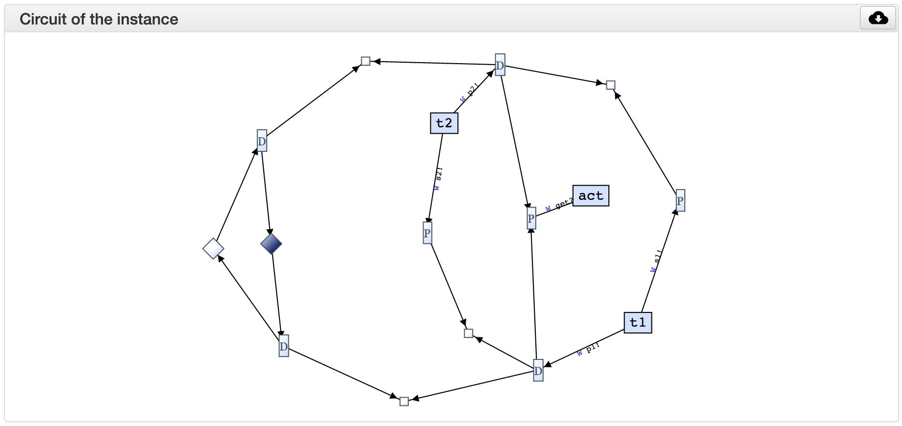

Using the tools
***************

Lightweight vs Server mode
===========================

.. figure:: _static/imgs/lw-vs-server.png
    :align: center
    :target: _static/imgs/lw-vs-server.png

    Lightweight vs Server mode

While the toolset is developed in Scala, the code is compiled both into *JVM*
binaries that are executed on a **server** (*Full Hubs*), and into **JavaScript** using
`ScalaJS <https://wwws.scala- js.org>`_ to produce an interactive web page (*LW Hubs*).

Both versions provide *almost* the same functionality, with the server
additionally supporting the live verification of properties through the Uppaal model checker.
Everything else apart from the live verification is computed
by the browser using the generated JavaScript libraries.

Widgets
=======

The toolset is organized in a set of widgets, each of them providing some functionality:
edition, visualization, or analysis.

By clicking in a widgets' name it is possible to `open` or `close` such a widget.
By default only some widgets are open.

All widgets, except the `Examples` widget use the hub specified in the `Hub composer`
to carried on with their functionality.

Below we explain each widget in detail.

.. _composer-widget:

Hub Composer
------------

.. figure:: _static/imgs/widgets/composer.png
    :align: center
    :scale: 40 %

    Hub composer - Example code

It is **the editor** where users can specify *hubs* and *tasks* with different interaction semantics.

Hubs are specified by **composing** predefined hubs.
We provide the list of primitive hubs below, followed by an explanation on how to composed them.

Tasks are defined as a sequence of input or output ports,
each of which can connect to the environment following the sequence order,
and using a specified interaction semantics.
This is explained below in further detail.

.. admonition:: Load the hub

    Whenever a hub is specified, it is required to **load the hub** so that other widgets can analysed or visualised such a hub.
    The hub can be loaded either by pressing ``shift`` + ``enter`` in the `Hub Composer`, or
    by clicking in the update icon on the top right of the widget.

Primitive Hubs
^^^^^^^^^^^^^^

Keyword for predefined hubs are listed in the following table.
They are separated into original hubs in VirtusoNext™ and newly proposed hubs.

.. |port| image:: _static/imgs/hubs/port.svg
.. |event| image:: _static/imgs/hubs/event.svg
.. |dEvent| image:: _static/imgs/hubs/dataEvent.svg
.. |sema| image:: _static/imgs/hubs/semaphore.svg
.. |resrc| image:: _static/imgs/hubs/resource.svg
.. |fifo| image:: _static/imgs/hubs/fifo.svg
.. |bb| image:: _static/imgs/hubs/blackboard.svg
.. |drain| image:: _static/imgs/hubs/drain.svg
.. |merger| image:: _static/imgs/hubs/port.svg

.. |eventF| image:: _static/imgs/hubs/eventFull.svg

.. |xor| image:: _static/imgs/hubs/xor.svg

.. |semaA| image:: _static/imgs/tha/semaphore.png

Original Hubs from VirtuosoNext™

=================== =================
Hub                 Keyword
=================== =================
|port| Port         ``port``
|event| Event        ``event``
|dEvent| DataEvent  ``dataEvent``
|sema| Semaphore    ``semaphore``
|resrc| Resource    ``resource``
|fifo| FIFO         ``fifo``
|bb| BlackBoard     ``blackboard``
=================== =================

Newly proposed hubs

======================== ==========================
Hub                      Keyword
======================== ==========================
|drain| Drain            ``drain``
|merger| Merger          ``merger``
|xor| Exclusive Router   ``xor``
|dupl| Duplicator        ``dupl``
|eventF| EventFull       ``eventFull``
|dEventF| DataEventFull  ``dataEventFull``
|fifoF| FIFOFull         ``fifoFull``
|bbF| BlackBoardFull     ``blackboardFull``
|timer| Timer            ``timer`` or ``timer(n)``
                         (*n* a positive integer)
======================== ==========================

Tasks
^^^^^

We can model tasks by using a predefined construct defined by the following grammar:

.. math::

    \begin{align*}
        tk              :=~& \texttt{task<}\mathit{name}\texttt{>(} \mathit{port}^{*} \texttt{)} ~[\texttt{every}~n] \\
        \mathit{mode}   :=~& \texttt{W} ~|~ \texttt{NW} ~|~ \mathit{n} \\
        \mathit{port}   :=~& \mathit{mode~name~io} \\
        \mathit{io}     :=~& \texttt{!} ~|~ \texttt{?}
    \end{align*}

A task tries to communicate with the environment through its IO ports in the order established by the declaration and
following the specified interaction semantics.

These interaction semantics determine how a task waits on a request to succeed.
These can be:

 * waiting (W) – a task waits indefinitely until the request can be served
 * non-waiting (NW) – either the requests is served without delay or the request fails
 * waiting with time-out (WT) – waits either until the request is served or the specified time-out has expired.

.. note::

    When using the ``every`` construct,
    the ``n`` must be higher or equal to the total amount of time
    the task can wait to succeed on requests to its ports. For example,
    ``task<T1>(4 a!, 5 b!) every 10`` is valid: 4+5 <= 10, while
    ``task<T1>(NW a!, 5 b!) every 3`` is invalid: 5 > 3.
    As a consequence, these task cannot have a waiting interaction (``W``).

Examples
""""""""

The following code specifies a task named ``T1``,
with an input port ``a`` and an output port ``b``.

..  code:: haskell

        task<T1>(W a?, 4 b!)

``T1`` first tries to read from the environment on port ``a`` waiting until it succeeds (``W``).
When it succeeds, it tries to send data through ``b``, but it waits only ``4`` units of time, after this time
whether it succeeds, it starts again, trying to read in ``a``.
This semantics is given by the following THA.

.. figure:: _static/imgs/tha/t1.png
    :align: center
    :scale: 30 %

    ``T1`` semantics

Similarly, the following code specifies a task named ``T2``,
with an output port ``c``.
The task **periodically** tries to send data through ``c`` ``every 5`` units of time.

.. code-block:: haskell

    task<T2>(NW c!) every 5

Informally, the tasks tries to send data through ``c`` without waiting (``NW``).
Whether it succeeds, it will wait 5 units of time before starting again and trying to send data again.
Formally, this semantics is given by the following THA.

.. figure:: _static/imgs/tha/t2.png
    :align: center
    :scale: 30 %

    ``T2`` semantics

Composition
^^^^^^^^^^^

Preo syntax
"""""""""""
Composition using the **Preo** syntax is defined in a pointfree style, i.e., without naming the ports.

Composition of hubs and tasks can be sequential ``;`` (outputs to inputs)
or parallel ``*`` (appending inputs and outputs).
A type system guarantees that composition is correct.

The sequential composition requires that the number of outputs match the number of inputs in the sequence.

.. code::

    dupl ; fifo  * event

This code specifies a ``duplicator`` hub
where the first output connects to the input of a ``fifo`` hub,
and the second output connects to the input of an ``event`` hub.

More complex examples are available in the Examples widget `online <http://arcatools.org/hubs>`_
(see :ref:`examples-widget`).

Preo syntax is extended as well with integers and booleans expression that can simplify the definition of complex hubs.

* `primHub` ``^n`` : `n` hubs of type `primHub`, `n` a positive integer
* `primHub` ``!`` :  as many `primHub` such that their inputs and outputs connect with correctly with any other hubs that may connect in sequence with *primHub*
* ...

.. code-block::
    :linenos:

    // for fifo hubs in parallel, composed in sequence with as many merger hubs needed (2 in this case).
    fifo^4 ; merger!

.. note::

    Checkout `Typed Connector Families and Their Semantics <http://jose.proenca.org/papers/connector-families/scp-cfam.pdf>`_
    to read the theory behind Preo.

Treo syntax
"""""""""""

.. _circuit-widget:

Circuit of the instance
-----------------------

    Hub circuit - Two task, ``t1`` and ``t2``, write in sequence to another task ``act``

This widget shows the architectural view of the hub specified in the `Hub Composer`, i.e. how primitive hubs
and tasks are connected to form a more complex hub.

**Blue boxes** with names represent `tasks`;
**white circles**, if any, represent free `input/output ports`, i.e. ports that haven't been connected yet; and
**the rest of the nodes** represent `primitive hubs`.

**Arrows** represent `connections` from output to input ports.
Incoming and outgoing arrows from tasks are labeled with the corresponding interaction semantics
(``W``, ``NW``, ``n`` - ``n`` a positive integer), the port's name (only when using the **Treo** syntax), and
the type of port (input or output).

Hub Automaton of the instance
-----------------------------

    (Timed) Hub Automaton - Example automaton for a hub ``timer(5)``

This widget shows the simplified and serialized automaton of the hub specified in the `Hub Composer`.

A **white circled location** represents the initial state.
All locations have a **clock invariant**, represented by a purple label next to the location node, e.g. :math:`cl\leq 5` (right location).
Locations that do not show any clock invariant are locations with trivially satisfied invariants, namely :math:`\top`.

Transitions are labeled as followed:

    - **guard constraint**, represented by a green label within angle brackets, e.g. :math:`\langle \top \rangle`
    - **clock constraint**, if any, represented by a yellow label following the guard constraint, e.g. :math:`cl == 5` (bottom transition)
    - **synchronizing ports**, represented by blue labels, e.g. :math:`in\downarrow`, where :math:`\downarrow` represents an input port, and :math:`\uparrow` an output port
    - **updates**, if any, represented by a dark blue label, e.g. :math:`bf:=in` (top transition)
    - **clock updates**, if any, represented by a purple label, e.g. :math:`cl:=0` (top transition)

.. _examples-widget:

Examples
--------

.. figure:: _static/imgs/widgets/examples.png
    :align: center
    :scale: 60 %

    Examples - A set of example hubs written in `Preo` and `Treo` syntax

This widget provides a set of example hubs,
from primitive (e.g. `Port` and `Port - 2 sources`) to more complex ones (e.g. `Alternator` and `Sequencer`).

Some examples are written in `Preo` syntax, such as `Alternator (no variables)`, and others in `Treo` syntax, such as `Alternator`.

By clicking on one of the examples, the corresponding code will be loaded in the `Hub Composer` and it will trigger the update of other
widgets that are opened.

Context Switch Analysis
-----------------------

.. figure:: _static/imgs/widgets/context.png
    :align: center
    :scale: 60 %

    Context Switch Analysis - Minimum number of context switches for the trace ``p1,p2`` in the hub example from :ref:`circuit-widget`

This widget is an interactive panel to estimate the minimum number of context switches that a given trace in
the current hub will have if implemented in VirtuosoNext™.

A trace is a sequence of ports executions. In the example, the trace ``p1,p2`` captures any trace in which ``p1`` executes,
followed by the execution of port ``p2``. In bot cases, ``p1`` and ``p2`` could execute synchronously with other ports.

It is possible to express ``n`` -sequential executions of the same port ``p`` as ``p^n``.
For example ``p^3``, instead of ``p,p,p``.

The trace can be specified in the text box next to the `Pattern:`.
After which, it is required to load the trace by
either pressing ``shift`` + ``enter`` or clicking on the load icon on the top right of the box.

The widget will present the analysis below by stating the minimum number of context switches required,
showing the transitions that follow such a trace and the number of context switches per transition.

In the example, the trace ``p1,p2`` requires in the best case `12 CS`.
Starting from the initial state `1` it transitions to state `2`
by executing synchronously ports ``s2``, ``get``, and ``p1``.
CS occurs when the execution changes from the **Kernel** to some user **task** and vice-versa.
Hubs execute in the Kernel.

The following table summarises the possible sequence of CS between the Kernel task (executing the hub) and the user
tasks responsible for the synchronisation requests on ports ``s2``, ``s1``, ``get``, ``p1``, and ``p2``.
**Each line represents 1 CS**.

Notice that this is just an example.
In reality, the order in which the kernel selects which task to execute next depends on many factors,
including the priority of the tasks, and other tasks that might be executing.

=====  ===================  ===============  ===================
#      Control From         Synchronisation  Control To
                            Request
=====  ===================  ===============  ===================
1 	   Kernel								 Task with s2
2      Task with s2         s2               Kernel
3      Kernel                                Task with get
4      Task with get        get              Kernel
5      Kernel                                Task with p1
6      Task with p1         p1               Kernel
-----  -------------------  ---------------  -------------------
7      Kernel                                Task with s1
8      Task with s1         s1               Kernel
9      Kernel                                Task with get
10     Task with get        get              Kernel
11     Kernel                                Task with p2
12     Task with p2         p2               Kernel
=====  ===================  ===============  ===================

For example, assuming the execution starts in the Kernel and there are not other tasks executing apart from the ones mentioned.
The Kernel selects the next task to execute (based on priority, etc.), in this case, the task responsible for ``s2``,
and it takes 1 CS to change control to the such a task.
This task then request to synchronise on port ``s2`` and the control goes back to the kernel (+1 CS).

Please notice that this widget is experimental.

Hub Automaton Analysis
----------------------

A summary of some structural properties of the automaton,
such as estimated required memory, size estimation of the code,
information about which hubs’ ports are always ready to synchronise ...

Temporal Logic
--------------

An interactive panel to verify a list of given timed behavioural properties,
relying on Uppaal running in our servers ...

Their result are shown together with the associated Uppaal models and formulas ...

Uppaal Model
------------

The timed automaton to be imported by Uppaal model checker...

