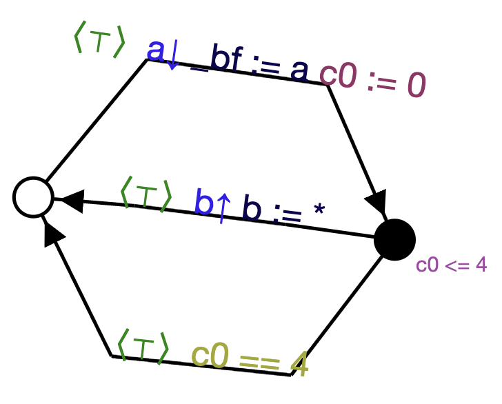
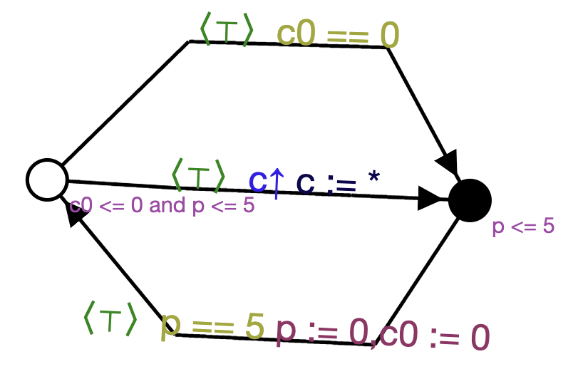
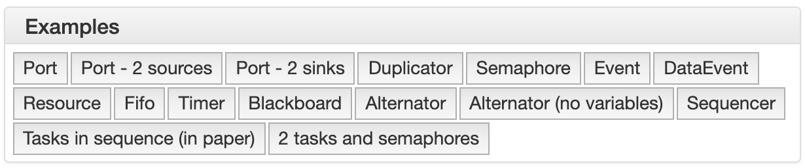
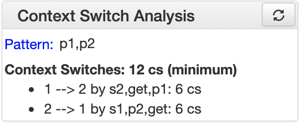
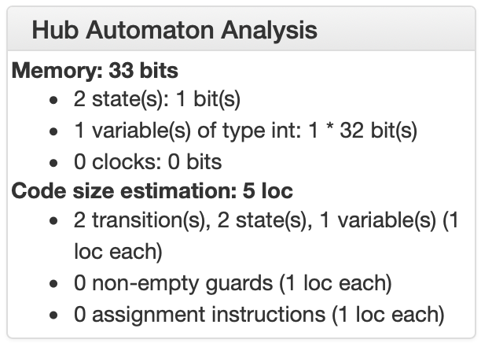
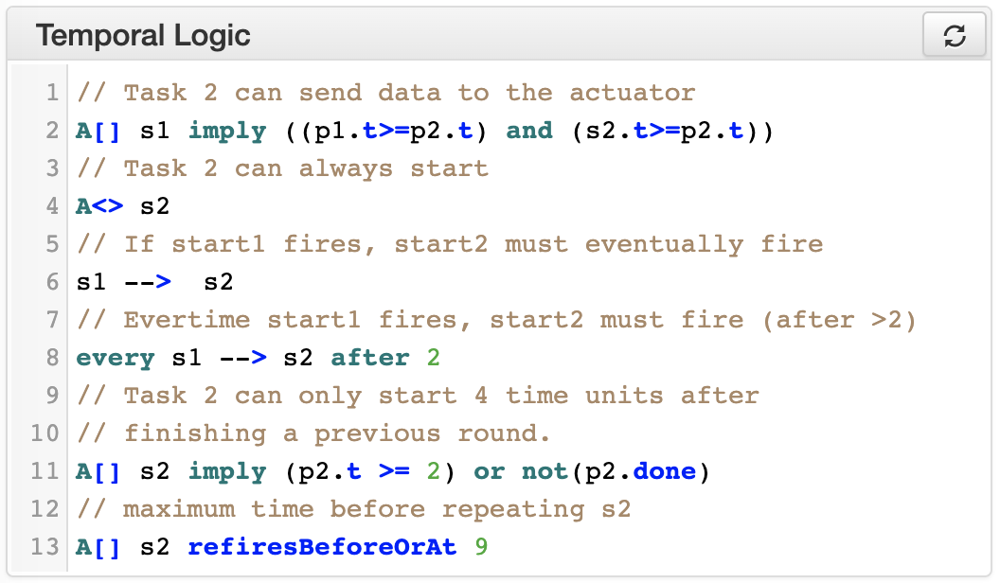
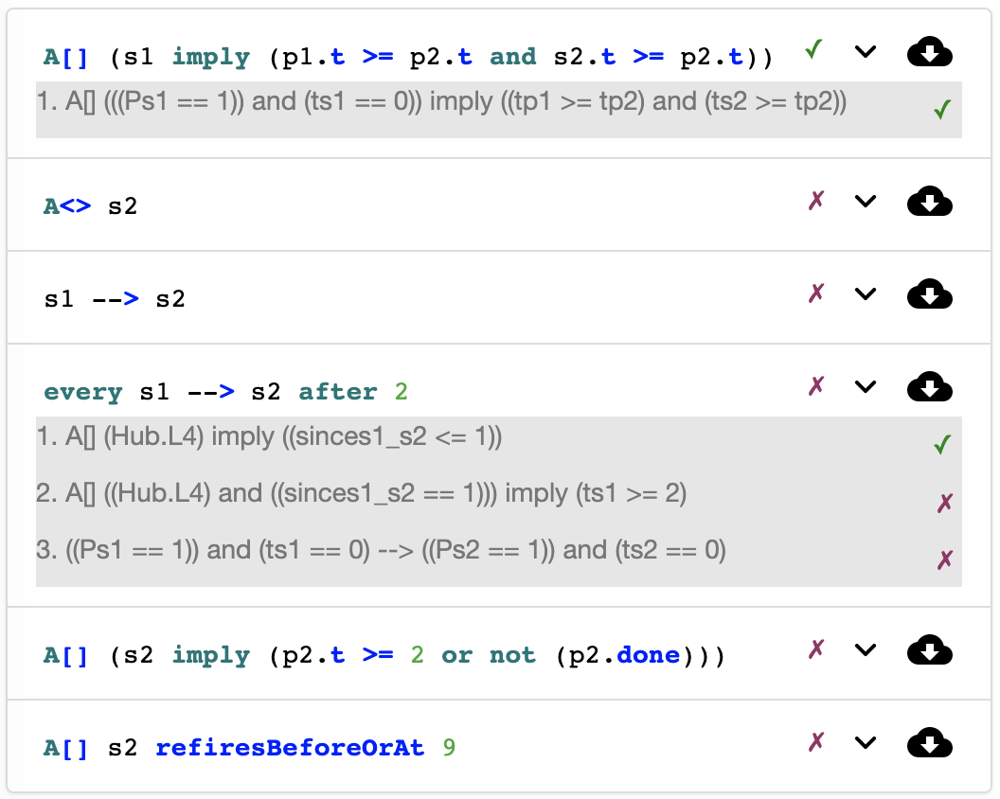

Using the tools
***************

.. |download| image:: _static/imgs/download.svg

Server vs Lightweight mode
==========================

.. figure:: _static/imgs/lw-vs-server.png
    :align: center
    :target: _static/imgs/lw-vs-server.png

    Server (Full Hubs) vs Lightweight mode (LW Hubs)

While the toolset is developed in Scala, the code is compiled both into *JVM*
binaries that are executed on a **server** (*Full Hubs*), and into **JavaScript** using
`ScalaJS <https://wwws.scala- js.org>`_ to produce an interactive web page (*LW Hubs*).

Both versions provide *almost* the same functionality, with the server
additionally supporting the live verification of properties through the Uppaal model checker.
Everything else apart from the live verification is computed
by the browser using the generated JavaScript libraries.

Widgets
=======

The toolset is organized in a set of widgets, each of them providing some functionality:
edition, visualization, or analysis.

By clicking in a widgets' name it is possible to `open` or `close` such a widget.
By default only some widgets are open.

All widgets, except the `Examples` widget use the hub specified in the `Hub composer`
to carried on with their functionality.

Below we explain each widget in detail.

.. _composer-widget:

Hub Composer
------------

.. figure:: _static/imgs/widgets/composer.png
    :align: center
    :scale: 40 %

    Hub composer - Example code

It is **the editor** where users can specify *hubs* and *tasks* with different interaction semantics.

Hubs are specified by **composing** predefined hubs.
We provide the list of primitive hubs below, followed by an explanation on how to composed them.

Tasks are defined as a sequence of input or output ports,
each of which can connect to the environment following the sequence order,
and using a specified interaction semantics.
This is explained below in further detail.

.. admonition:: Load the hub

    Whenever a hub is specified, it is required to **load the hub** so that other widgets can analysed or visualised such a hub.
    The hub can be loaded either by pressing ``shift`` + ``enter`` in the `Hub Composer`, or
    by clicking in the update icon on the top right of the widget.

Primitive Hubs
^^^^^^^^^^^^^^

Keyword for predefined hubs are listed in the following table.
They are separated into original hubs in VirtusoNext™ and newly proposed hubs.

.. |port| image:: _static/imgs/hubs/port.svg
.. |event| image:: _static/imgs/hubs/event.svg

.. |sema| image:: _static/imgs/hubs/semaphore.svg
.. |resrc| image:: _static/imgs/hubs/resource.svg
.. |fifo| image:: _static/imgs/hubs/fifo.svg
.. |bb| image:: _static/imgs/hubs/blackboard.svg

.. |merger| image:: _static/imgs/hubs/port.svg
.. |dupl| image:: _static/imgs/hubs/dupl.svg
.. |eventF| image:: _static/imgs/hubs/eventFull.svg
.. |dEventF| image:: _static/imgs/hubs/dataEventFull.svg
.. |fifoF| image:: _static/imgs/hubs/fifoFull.svg
.. |bbF| image:: _static/imgs/hubs/blackboardFull.svg
.. |timer| image:: _static/imgs/hubs/timer.svg
.. |xor| image:: _static/imgs/hubs/xor.svg

.. |semaA| image:: _static/imgs/tha/semaphore.png

Original Hubs from VirtuosoNext™

=================== =================
Hub                 Keyword
=================== =================
|port| Port         ``port``
|event| Event        ``event``
|dEvent| DataEvent  ``dataEvent``
|sema| Semaphore    ``semaphore``
|resrc| Resource    ``resource``
|fifo| FIFO         ``fifo``
|bb| BlackBoard     ``blackboard``
=================== =================

Newly proposed hubs

======================== ============================================
Hub                      Keyword
======================== ============================================
|drain| Drain            ``drain``
|merger| Merger          ``merger``
|xor| Exclusive Router   ``xor``
|dupl| Duplicator        ``dupl``
|eventF| EventFull       ``eventFull``
|dEventF| DataEventFull  ``dataEventFull``
|fifoF| FIFOFull         ``fifoFull``
|bbF| BlackBoardFull     ``blackboardFull``
|timer| Timer            ``timer`` or ``timer(n)``
                         (*n* a positive integer, *0* when omitted)
======================== ============================================

Tasks
^^^^^

We can model tasks by using a predefined construct defined by the following grammar:

.. math::

    \begin{align*}
        tk              :=~& \texttt{task<}\mathit{name}\texttt{>(} \mathit{port}^{*} \texttt{)} ~[\texttt{every}~n] \\
        \mathit{mode}   :=~& \texttt{W} ~|~ \texttt{NW} ~|~ \mathit{n} \\
        \mathit{port}   :=~& \mathit{mode~name~io} \\
        \mathit{io}     :=~& \texttt{!} ~|~ \texttt{?}
    \end{align*}

A task tries to communicate with the environment through its IO ports in the order established by the declaration and
following the specified interaction semantics.

These interaction semantics determine how a task waits on a request to succeed.
These can be:

 * waiting (W) – a task waits indefinitely until the request can be served
 * non-waiting (NW) – either the requests is served without delay or the request fails
 * waiting with time-out (WT) – waits either until the request is served or the specified time-out has expired.

.. note::

    When using the ``every`` construct,
    the ``n`` must be higher or equal to the total amount of time
    the task can wait to succeed on requests to its ports. For example,
    ``task<T1>(4 a!, 5 b!) every 10`` is valid: 4+5 <= 10, while
    ``task<T1>(NW a!, 5 b!) every 3`` is invalid: 5 > 3.
    As a consequence, these task cannot have a waiting interaction (``W``).

Examples
""""""""

The following code specifies a task named ``T1``,
with an input port ``a`` and an output port ``b``.

..  code:: haskell

        task<T1>(W a?, 4 b!)

``T1`` first tries to read from the environment on port ``a`` waiting until it succeeds (``W``).
When it succeeds, it tries to send data through ``b``, but it waits only ``4`` units of time, after this time
whether it succeeds, it starts again, trying to read in ``a``.
This semantics is given by the following THA.

    ``T1`` semantics

Similarly, the following code specifies a task named ``T2``,
with an output port ``c``.
The task **periodically** tries to send data through ``c`` ``every 5`` units of time.

.. code-block:: haskell

    task<T2>(NW c!) every 5

Informally, the tasks tries to send data through ``c`` without waiting (``NW``).
Whether it succeeds, it will wait 5 units of time before starting again and trying to send data again.
Formally, this semantics is given by the following THA.

    ``T2`` semantics

Composition
^^^^^^^^^^^

.. _preo:

Preo syntax
"""""""""""
Composition using the **Preo** syntax is defined in a pointfree style, i.e., without naming the ports.

Composition of hubs and tasks can be sequential ``;`` (outputs to inputs)
or parallel ``*`` (appending inputs and outputs).
A type system guarantees that composition is correct.

The sequential composition requires that the number of outputs match the number of inputs in the sequence.

.. code::

    dupl ; fifo  * event

This code specifies a ``duplicator`` hub
where the first output connects to the input of a ``fifo`` hub,
and the second output connects to the input of an ``event`` hub.

More complex examples are available in the :ref:`examples-widget` widget `online <http://arcatools.org/hubs>`_.

Preo syntax is extended as well with integers and booleans expression that can simplify the definition of complex hubs.

* `hub` ``^n`` : `n` hubs of type `hub`, `n` a positive integer
* `hub` ``!`` :  as many `hub` such that their inputs and outputs connect correctly with another hubs
  that may connect in sequence with *hub*

.. code-block::

    // for fifo hubs in parallel, composed in sequence with as many merger hubs needed (2 in this case).
    fifo^4 ; merger!

.. note::

    Checkout `Typed Connector Families and Their Semantics <http://jose.proenca.org/papers/connector-families/scp-cfam.pdf>`_
    to read the theory behind Preo.

.. _treo:

Treo syntax
"""""""""""

In the **Treo** syntax hubs are specified by explicitly naming their port.

Furthermore, a new hub needs to be declare in a function like manner, by specifying their ports as parameters
and declaring whether each parameter is an input port ``?`` or an output port ``!``.

Composition is specified by declaring two hubs separeted with spaces.
Composed hubs with shared port names will synchronize over such ports.

.. code::

    // Main block (Preo Syntax)
    // uses the hub myDupl specified in the code block
    myDupl

    {
        // a hub using Treo syntax
        myDupl(in?,out1!,out2!) =
            dupl(in,o1,o2)
            fifo(o1,out1)
            event(o2,out2)
        ,

        // an equivalent hub to myDupl, declared using Preo syntax
        otherDupl = dupl ; fifo * event
    }

More complex examples are available in the :ref:`examples-widget` widget `online <http://arcatools.org/hubs>`_.

Specifying Hubs
^^^^^^^^^^^^^^^

THe main Hub is specified following the :ref:`preo`.

It is possible to declare various hubs, using the :ref:`preo` or :ref:`treo`,
by declaring them in a function like manner inside a block `{ }` and referencing their names.
Various hubs specified inside the block are separated by ``,``.

.. code::

    // Main block (Preo Syntax)
    // uses the hub myDupl specified in the code block
    timer(5) ; myDupl

    {
        // a hub using Treo syntax
        myDupl(in?,out1!,out2!) =
            dupl(in,o1,o2)
            fifo(o1,out1)
            event(o2,out2)
        ,

        // an equivalent hub to myDupl, declared using Preo syntax
        otherDupl = dupl ; fifo * event

        ,

        // yet another hub equivalent to myDupl
        yetAnotherDupl(i?, o1!, o2!) = otherDupl(i,o1,o2)

    }

.. _circuit-widget:

Circuit of the instance
-----------------------

.. figure:: _static/imgs/widgets/circuit.png
    :align: center
    :scale: 40 %

    Hub circuit - Two task, ``t1`` and ``t2``, write in sequence to another task ``act``

This widget shows the architectural view of the hub specified in the `Hub Composer`, i.e. how primitive hubs
and tasks are connected to form a more complex hub.

**Blue boxes** with names represent `tasks`;
**white circles**, if any, represent free `input/output ports`, i.e. ports that haven't been connected yet; and
**the rest of the nodes** represent `primitive hubs`.

**Arrows** represent `connections` from output to input ports.
Incoming and outgoing arrows from tasks are labeled with the corresponding interaction semantics
(``W``, ``NW``, ``n`` - ``n`` a positive integer), the port's name (only when using the **Treo** syntax), and
the type of port (input or output).

Hub Automaton of the instance
-----------------------------

.. figure:: _static/imgs/widgets/automaton.png
    :align: center
    :scale: 40 %

    (Timed) Hub Automaton - Example automaton for a hub ``timer(5)``

This widget shows the simplified and serialized automaton of the hub specified in the `Hub Composer`.

A **white circled location** represents the initial state.
All locations have a **clock invariant**, represented by a purple label next to the location node, e.g. :math:`cl\leq 5` (right location).
Locations that do not show any clock invariant are locations with trivially satisfied invariants, namely :math:`\top`.

Transitions are labeled as followed:

    - **guard constraint**, represented by a green label within angle brackets, e.g. :math:`\langle \top \rangle`
    - **clock constraint**, if any, represented by a yellow label following the guard constraint, e.g. :math:`cl == 5` (bottom transition)
    - **synchronizing ports**, represented by blue labels, e.g. :math:`in\downarrow`, where :math:`\downarrow` represents an input port, and :math:`\uparrow` an output port
    - **updates**, if any, represented by a dark blue label, e.g. :math:`bf:=in` (top transition)
    - **clock updates**, if any, represented by a purple label, e.g. :math:`cl:=0` (top transition)

.. warning::

    There is a known issue where labels of the automaton 
    are not visualised in the current version of Firefox.

.. _examples-widget:

Examples
--------

    Examples - A set of example hubs written in `Preo` and `Treo` syntax

This widget provides a set of example hubs,
from primitive (e.g. `Port` and `Port - 2 sources`) to more complex ones (e.g. `Alternator` and `Sequencer`).

Some examples are written in `Preo` syntax, such as `Alternator (no variables)`, and others in `Treo` syntax, such as `Alternator`.

By clicking on one of the examples, the corresponding code will be loaded in the `Hub Composer` and it will trigger the update of other
widgets that are opened.

Context Switch Analysis
-----------------------

    Context Switch Analysis - Minimum number of context switches for the trace ``p1,p2`` from the hub example from :ref:`circuit-widget`

This widget is an interactive panel to estimate the minimum number of context switches that a given trace in
the current hub will have if implemented in VirtuosoNext™.

A trace is a sequence of ports executions. In the example, the trace ``p1,p2`` captures any trace in which ``p1`` executes,
followed by the execution of port ``p2``. In bot cases, ``p1`` and ``p2`` could execute synchronously with other ports.

It is possible to express ``n`` -sequential executions of the same port ``p`` as ``p^n``.
For example ``p^3``, instead of ``p,p,p``.

The trace can be specified in the text box next to the `Pattern:`.
After which, it is required to load the trace by
either pressing ``shift`` + ``enter`` or clicking on the load icon on the top right of the box.

The widget will present the analysis below by stating the minimum number of context switches required,
showing the transitions that follow such a trace and the number of context switches per transition.

In the example, the trace ``p1,p2`` requires in the best case `12 CS`.
Starting from the initial state `1` it transitions to state `2`
by executing synchronously ports ``s2``, ``get``, and ``p1``.
Context switches occur when the execution changes from the **Kernel** to some user **task** and vice-versa.
Hubs execute in the Kernel task.

The following table summarises the possible sequence of CS between the Kernel task (executing the hub) and the user
tasks responsible for the synchronisation requests on ports ``s2``, ``s1``, ``get``, ``p1``, and ``p2``.
**Each line represents 1 CS**.

Notice that this is just an example.
In reality, the order in which the kernel selects which task to execute next depends on many factors,
including the priority of the tasks, and other tasks that might be executing.

=====  ===================  ===============  ===================
#      Control From         Synchronisation  Control To
                            Request
=====  ===================  ===============  ===================
1 	   Kernel								 Task with s2
2      Task with s2         s2               Kernel
3      Kernel                                Task with get
4      Task with get        get              Kernel
5      Kernel                                Task with p1
6      Task with p1         p1               Kernel
-----  -------------------  ---------------  -------------------
7      Kernel                                Task with s1
8      Task with s1         s1               Kernel
9      Kernel                                Task with get
10     Task with get        get              Kernel
11     Kernel                                Task with p2
12     Task with p2         p2               Kernel
=====  ===================  ===============  ===================

For example, assuming the execution starts in the Kernel and there are not other tasks executing apart from the ones mentioned.
The Kernel selects the next task to execute (based on priority, etc.), in this case, the task responsible for ``s2``,
and it takes 1 CS to change control to the such a task.
This task then request to synchronise on port ``s2`` and the control goes back to the kernel (+1 CS).

Please notice that this widget is experimental.

Hub Automaton Analysis
----------------------

    THA Analysis - example of structural properties for the automaton of the hub specified in the :ref:`composer-widget`

This widget provides a summary of some structural properties of the timed hub automaton.
Currently:

- **Memory estimation** -
  minimum memory size (bits) required in terms of data (assumes Integer variables) and clock variables (Float variables),
  and in terms space needed to encode all states.
  Typically :math:`\lceil\log_2(n)\rceil` bits are required to encode n states.

- **Code size estimation** -
  lines of code needed to encode the hub. Typically one line per: transition, state, variable,
  guard, and assignment instruction. We consider assignment instruction to clock resets and assignments on internal variables.
  Assignments from input to output ports are not consider as such.

- **Always available ports** -
  information about which ports of the hub are always ready to synchronise (up to some restrictions).
  This is, ports that are ready to execute in any state of the hub, possibly up to some restrictions imposed by guards, or
  synchronizations with other ports. For example in a data ``dataEvent`` hub, the input port is always ready to synchronize
  without delay, and without restrictions imposed by the hub - transitions with this port are single-action transitions
  and have a trivially satisfied guard.

.. _temporal-widget:

Temporal Logic
--------------

    Temporal Logic - example of temporal properties for the automaton of the hub specified in the :ref:`composer-widget`

This widget is the editor where the user can specify a list of `timed behavioral properties`,
and (if using the server version) `verify` them by relying on an instance of the Uppaal model checker running in our server
(if using `ArcaTools <http://arcatools.org/assets/hubs.html>`_)
or the user's computer (if using a local installation).

The grammar
^^^^^^^^^^^

Properties are given using a **dynamic temporal logic** proposed for Timed Hub Automata,
which can be seen as a subset of Uppaal Timed Computation Tree Logic (TCTL).
This logic provides new operators to reason about the behaviour of the systems
focusing on **actions**, i.e., on ports that are fired rather than on locations as Uppaal TCTL.

TCTL properties are described using path formulas and state formulas. A
path formula quantifies over paths of the underlying transition system, while
a state formula quantifies over a single state of such system.

A valid property consists of a `path formula` `pf` given by the following grammar

.. code:: none

      // path formula
      pf ::= A[] sf | E[] sf | A<> sf | E<> sf | sf --> sf | every a --> b [after n]

      // state formula
      sf ::= a | a.doing | a.done
           | a refiresAfter n | a refiresAfterOrAt n | a refiresBefore n | a refiresBeforeOrAt n |
           | not sf
           | sf and sf | sf imply sf | sf or sf
           | ecc
           | deadlock | nothing

      // extended clock constraints
      ecc ::= c # n | c - # n | ecc and ecc | a.t # n

      // clock constraints operators
      # :: =  < | <= | == | >= | >

where `a` and `b` are port names, `c` is a clock, and `n` is an Integer.
``A`` and ``E`` are the universal and existential quantifiers over paths,
while ``[]`` and ``<>`` are the universal and existential quantifiers over states.
``a.t`` is a special clock assigned to port `a` that is set to `0` every time `a` fires -- i.e.,
after `a` fired, this clock tracks the time since `a` last fired.

The following table describes intuitively when each formula is satisfied.

========================= =======================================================================
Construct                      Description
========================= =======================================================================
``A[] sf``                 Holds if in **all** possible paths,
                           ``sf`` holds in **all** states
``A<> sf``                 Holds if in **all** possible paths,
                           ``sf`` holds in **at least one** state
``E[] sf``                 Holds if in **at least one** path,
                           ``sf`` holds in **all** states
``E<> sf``                 Holds if in **at least one** path,
                           ``sf`` holds in **at least one** state
``sf1 --> sf2``            Holds if whenever in every path where ``sf1`` in some state `s`,
                           ``sf2`` is eventually satisfied along the path from `s`.
                           It is a shorthand for ``A[] (sf1 imply (A <> sf2 ))``.
                           Notice that neither Uppaal nor our logic allows nested
                           path formulas.
``every a --> b after n``  Holds if, whenever `a` fires, `b` will fire before `a` fires again,
                           but after 5 or more units of time since `a` fired.
``a``                      Holds at the time instance when port `a` fires.
``a.doing``                Holds if `a` was the last port to be fired.
``a.done``                 Holds if `a` has fired at least once.
``a refiresAfter n``       Holds in states where, if `a` fired,
                           then it cannot refire until more than `n` units of time passed.
``a refiresAfterOrAt n``   Holds in states where, if `a` fired,
                           then it cannot refire until `n` or more units of time passed.
``a refiresBefore n``      Holds in states where `a` fires
                           before less than `n` units of time passed since the beginning or since it last fired.
``a refiresBeforeOrAt n``  Holds in states where `a` fires
                           before `n` or less units of time passed since the beginning or since it last fired.
``not sf``                 Holds in states where sf is not satisfied
``sf1 and sf2``            Holds in states where both ``sf1`` and ``sf2`` are satisfied
``sf1 or sf2``             Holds in states where ``sf1`` or ``sf2`` are satisfied
``sf1 imply sf2``          Holds in states where if ``sf1`` is satisfied, ``sf2`` is satisfied as well.
                           In states where ``sf1`` is not satisfied
                           the property is trivially satisfied.
``nothing``                Holds in states where no action has fired previously.
``deadlock``               Holds in states where there are no outgoing action transitions
                           neither from the state itself or any of its delay successors.
``c # n``                  Holds in states where the current value of clock c, :math:`\eta(c)`,
                           satisfies the condition :math:`\eta(c) ~\#~ n`.
``c1 - c2 # n``            Holds in states where the current value of clock c1 and c2,
                           satisfy the condition :math:`\eta(c1) - \eta(c2) ~\#~ n`.
``ecc1 and ecc1``          Holds in states where both clock constraints ``ecc1`` and ``ecc2`` are
                           satisfied.
``a.t # n``                Holds in states where the current value of clock ``a.t``
                           satisfies the condition :math:`\eta(a.t) ~\#~ n`.
========================= =======================================================================

The widget
^^^^^^^^^^

To analyse the properties the user needs to load the properties
by either pressing ``shift`` + ``enter`` or by clicking on the load icon on the top right of the widget.

Even when using the lightweight version,
the widget provides the necessary information to verify each property using Uppaal manually.

After loading the properties, a new box appears showing the results.
In particular, for each property, the result box shows:

- whether it is satisfied (✓ or ✗). This is shown only when using the server version (Full Hubs)
- its encoding using Uppaal's temporal logic syntax. This is accessed by clicking on the expand button |showMore|.
  Notice that a property using our logic might be translated into several Uppaal properties.
  In this case, we show for each Uppaal property whether it is satisfied -
  all should be satisfied in order to satisfy the original property.
- the Uppaal model needed to verify such a property and the property itself encoded using Uppaals' syntax. This can be
  downloaded by clicking on |download|.

    Verification Information - Output result from loading the properties in the Temporal Logic box.

.. admonition:: One Uppaal model per property

    Depending on the kind of property, the model may need to incorporate more or less auxiliary variables
    in order to support such a query. For example, `a.done` query requires to add a Boolean variable `a_done` to the model,
    initialized as false and set to true whenever port `a` fires (never set to false again).
    Thus, each property has its own Uppaal model.

Manual verification using Uppaal
^^^^^^^^^^^^^^^^^^^^^^^^^^^^^^^^

Although the user can automatically verify properties from the temporal logic widget, as explained above,
it its possible to download the model |download| and import the model from the Uppaal model checker.

After running Uppaal, go to **File** -> **Open System** and select the ``.xml`` model downloaded either from the
:ref:`uppaal` or :ref:`temporal-widget` widget.

- **Editor**: shows the automaton of the hub and the structure of the Uppaal Project.
  Global declarations of variables, clocks, and channels, can be found under *Declarations*, while local declarations
  can be found under *Hub* -> *Declarations*. The initialization of the system is found under *System declarations*.
- **Simulator**: provides tools to simulate executions by selecting an enabled transition, while
  highlighting the current location in the automaton, among other functionality.
- **Verifier**: provides functionality to write temporal properties and verify them.
  If the model imported was downloaded from the :ref:`temporal-widget` widget,
  it will show the corresponding property for which the model was created.

.. _uppaal:

Uppaal Model
------------

.. figure:: _static/imgs/widgets/uppaal.png
    :align: center
    :scale: 50 %

    Uppaal Model - Uppaal timed automaton model of the hub specified in the `Hub Composer`.

This widget provides the base Uppaal timed automaton model of the hub specified in the `Hub Composer`.
By base we mean that the model does not have any auxiliary variable or committed states in between states of the original model, as is the case
with Uppaal models generated in the :ref:`temporal-widget` widget.

The model can be downloaded |download| and imported into the Uppaal model checker for further analysis.

